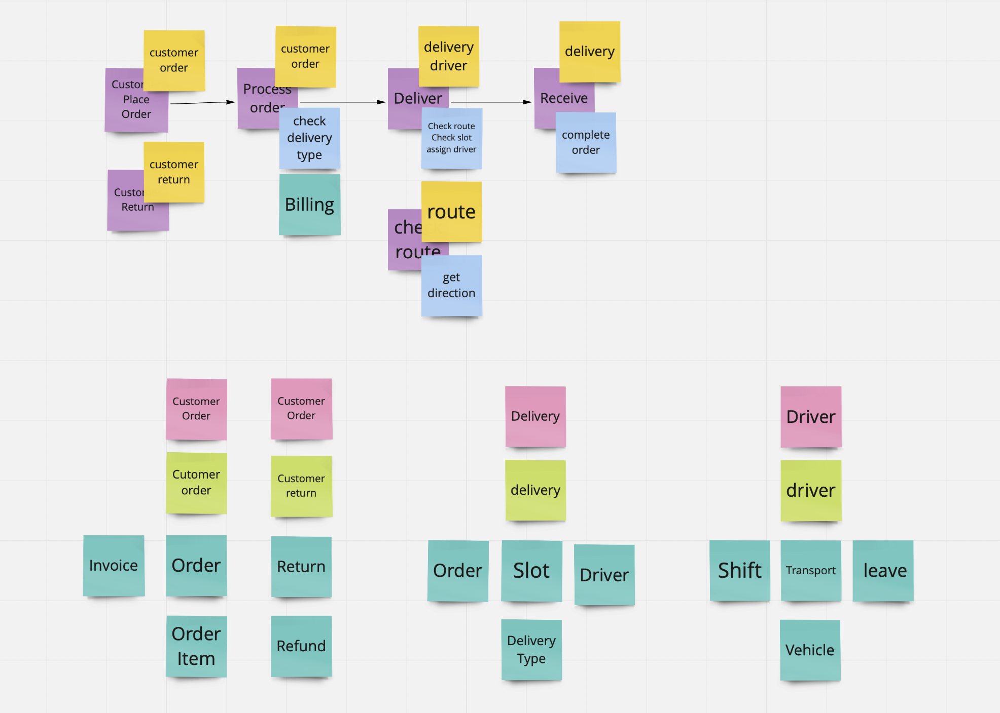

# Building MicroServices
การสร้าง MicroServices ด้วย Greenfield Approach(ไม่เคยมีระบบเดิมมาก่อน) ดังนั้นเราจะเริ่มต้นด้วยขั้นตอนต่างๆ ดังนี้

## Steps to create MicroServices
1. Bounded Context
2. Create Contract
3. Mocking Services
4. Implementing Service (Coding)
5. Integration Test

### Bounded Context
สร้าง Flow การทำงานก่อนด้วย post-it สีม่วง แล้วใส่ application services (สีฟ้า) ที่ต้องมีเข้าไป สุดท้ายจับรวม services ต่างๆเข้าไปอยู่ใน context ด้วย post-it สีเหลือง
- Context
- Core Concept
- Supporting Concept

ผลลัพธ์ที่ได้

### Create Contract (Contract Driven Development)
นำ Supporting Concept(สีฟ้า) มาสร้าง contract ซึ่ง contract มี 3 รูปแบบ ดังนี้ 
- apiblueprint (Design first)
- openAPI (Code first)
- RAML

### Mocking service
เมื่อเราได้่ Contract มาแล้วเราสามารถนำ Contract นั้นมาสร้าง Mockup หรือ API ตัวปลอมๆ ขึ้นมาได้ด้วยเครื่องมือต่างๆ ดังนี้

* Mocking apiblueprint
    * drakov
    * snowboard

* Mocking openAPI
    * prism

* Mocking แบบไม่มี contract (ใช้ในกรณีที่เราต้องคุยกับ services ที่ยังไม่มี contract หรือ services ภายนอก)
    * json-server

#### Contract Test
การสร้าง contract ต้องมั่นใจว่าตรงกับ API จริงๆ ดังนั้นต้องมีการทดสอบ contract อยู่เสมอเพื่อให้มั่นใจว่าเรา API ที่สร้่างขึ้นกับ contract ที่ประกาศไว้นั้นยังตรงกันอยู่จึงเป็นที่มาของ contact test
* dredd (Recommended)
* pact

#### Integration Test (API Testing)
เมื่อเราสร้าง API ขึ้นมาแล้ว จะยังไม่สามารถทำทุกอย่างให้เสร็จภายใน service เดียวได้ เพราะเรากำลังสร้าง MicroServices ดังนั้นเราเลยต้องทำการทดสอบการทำงานร่วมกับ service อื่นๆ ด้วยเครื่องมือต่างๆ ดังนี้
* Postman + newman (Recommend)
* Soap UI
